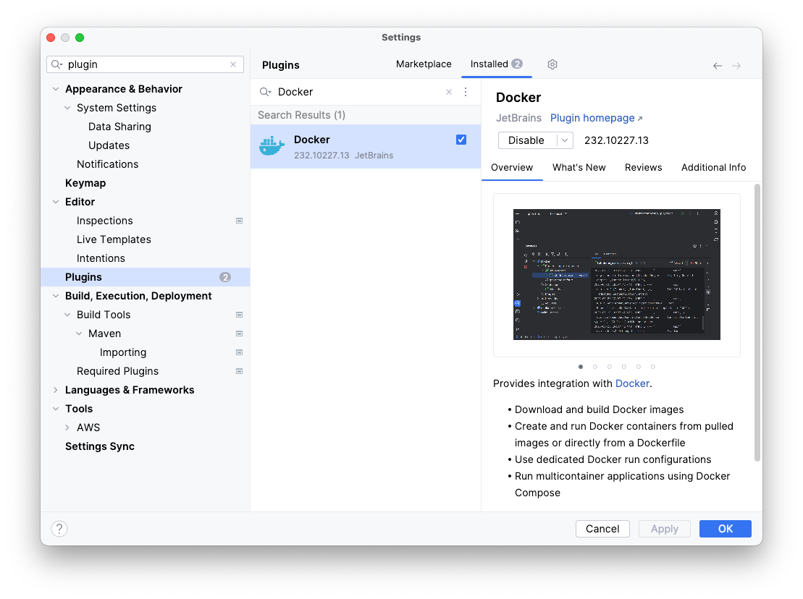
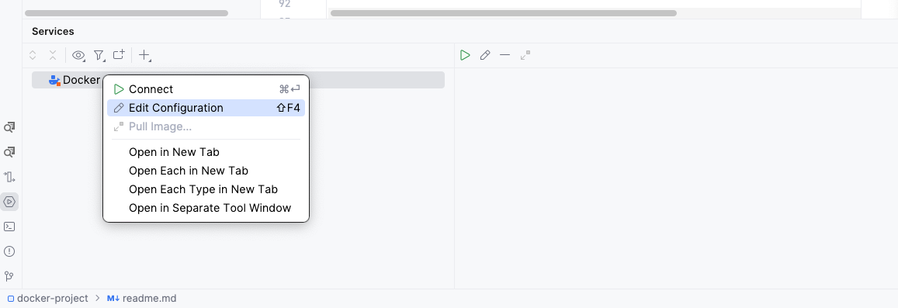
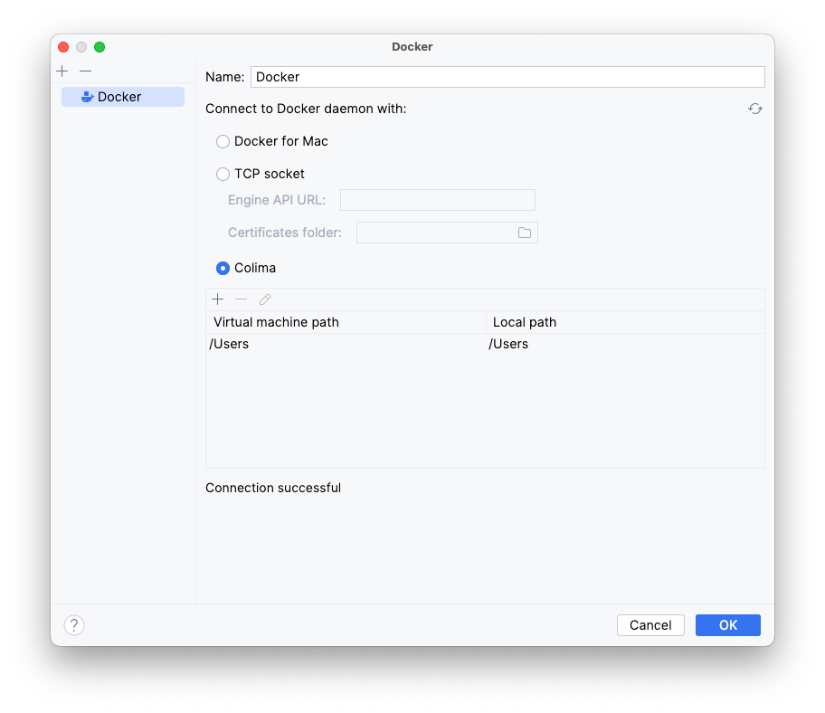
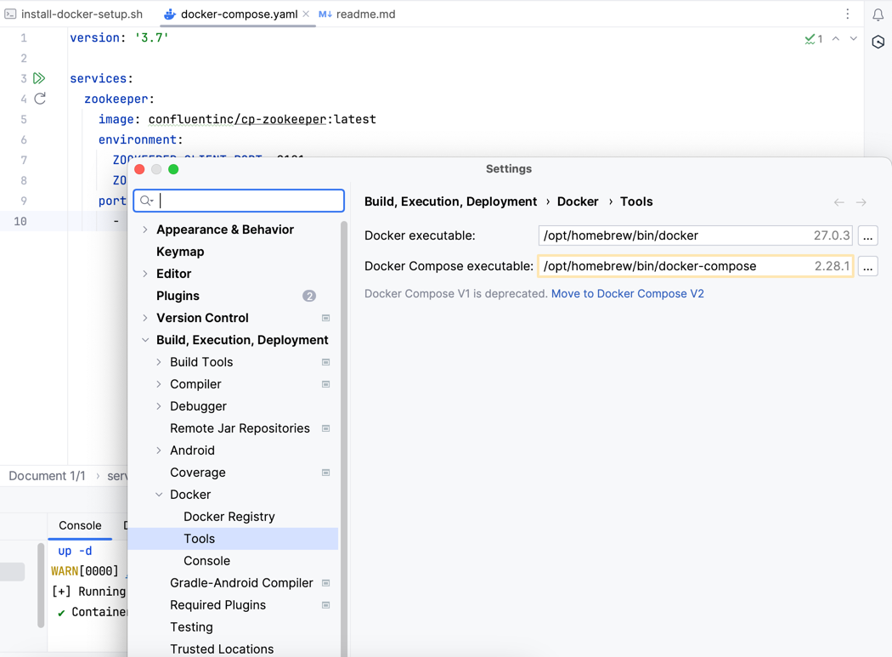

# MacOS Docker Setup

## Installation Process

#### Step 1: Make the script executable
```shell
chmod +x install-docker-setup.sh 
```

#### Step 2: Execute the installation script
```shell
./install-docker-setup.sh
```

#### Step 3: Verify the installation
```shell
docker ps
```
######  Command executes without error with sample output as below

```logcatfilter
arunveersingh@Aruns-MacBook-Pro docker-project % docker ps   
CONTAINER ID   IMAGE     COMMAND   CREATED   STATUS    PORTS     NAMES
```

```shell
docker context ls
```

######  Command executes without error with * on colima  
```logcatfilter
arunveersingh@Aruns-MacBook-Pro docker-project % docker context ls
NAME            DESCRIPTION                               DOCKER ENDPOINT                                           ERROR
colima *        colima                                    unix:///Users/arunveersingh/.colima/default/docker.sock   
default         Current DOCKER_HOST based configuration   unix:///var/run/docker.sock                               
desktop-linux   Docker Desktop                            unix:///Users/arunveersingh/.docker/run/docker.sock 
```

## How to start / stop docker 

#### Start
```shell
colima start
```
##### Output 
```logcatfilter
INFO[0000] starting colima                              
INFO[0000] runtime: docker                              
INFO[0001] starting ...                                  context=vm
INFO[0012] provisioning ...                              context=docker
INFO[0012] starting ...                                  context=docker
INFO[0013] done           
```

#### Stop
```shell
colima stop
```

##### Output
```logcatfilter
arunveersingh@Aruns-MacBook-Pro docker-project % colima stop
INFO[0000] stopping colima                              
INFO[0000] stopping ...                                  context=docker
INFO[0000] stopping ...                                  context=vm
INFO[0002] done          
```

##### Status
```shell
arunveersingh@Aruns-MacBook-Pro ~ % colima status
INFO[0000] colima is running using QEMU                 
INFO[0000] arch: aarch64                                
INFO[0000] runtime: docker                              
INFO[0000] mountType: sshfs                             
INFO[0000] address: 192.168.106.2                       
INFO[0000] socket: unix:///Users/arunveersingh/.colima/default/docker.sock 
arunveersingh@Aruns-MacBook-Pro ~ % 
```

Note: When Laptop restarts, docker stops. Use above start command and docker will come back to life.

## How to use IntelliJ UI

#### Install plugin


#### Edit Configuration


#### Connect to Docker daemon with Colima


#### How to configure docker-compose in IntelliJ


## Testcontainers

#### To run test containers these changes are needed so as testcontainers get the right docker-client.

##### Start colima with network command and set environment variables
```shell
colima start --network-address

brew install jq

export TESTCONTAINERS_DOCKER_SOCKET_OVERRIDE=/var/run/docker.sock
export TESTCONTAINERS_HOST_OVERRIDE=$(colima ls -j | jq -r '.address')
export DOCKER_HOST="unix://${HOME}/.colima/default/docker.sock"
```
##### Better to add in shell profile permanently, e.g.
```shell
arunveersingh@Aruns-MacBook-Pro ~ % vi ~/.zshrc
arunveersingh@Aruns-MacBook-Pro ~ % source ~/.zshrc
```

Reference:
1. https://java.testcontainers.org/supported_docker_environment/
2. https://golang.testcontainers.org/system_requirements/using_colima/


## Uninstallation Process

#### Step 1: Make the script executable
```shell
chmod +x uninstall-docker-setup.sh 
```

#### Step 2: Execute the uninstallation script
```shell
./uninstall-docker-setup.sh
```

#### Step 3: Verify the uninstallation
```shell
docker ps
```
######  Command execution results in below error

```logcatfilter
arunveersingh@Aruns-MacBook-Pro docker-project % docker ps
zsh: command not found: docker
```

## Kubernetes

### Command to start Kubernetes

#### First install kubectl, 
```shell
brew install kubectl
```

#### and then start Colima with Kubernetes,
```shell
colima start --kubernetes
```

#### Output
```logcatfilter
INFO[0012] provisioning ...                              context=docker
INFO[0012] starting ...                                  context=docker
INFO[0013] provisioning ...                              context=kubernetes
INFO[0013] downloading and installing ...                context=kubernetes
INFO[0071] loading oci images ...                        context=kubernetes
INFO[0077] starting ...                                  context=kubernetes
INFO[0081] updating config ...                           context=kubernetes
INFO[0082] Switched to context "colima".                 context=kubernetes
INFO[0083] done
```

#### Verification
```shell
kubectl cluster-info
```

#### Output
```logcatfilter
Kubernetes control plane is running at https://127.0.0.1:6443
CoreDNS is running at https://127.0.0.1:6443/api/v1/namespaces/kube-system/services/kube-dns:dns/proxy
Metrics-server is running at https://127.0.0.1:6443/api/v1/namespaces/kube-system/services/https:metrics-server:https/proxy
```

```shell
kubectl get pods --all-namespaces
```
#### Output
```logcatfilter
arunveersingh@Aruns-MacBook-Pro github % kubectl get pods --all-namespaces
NAMESPACE     NAME                                      READY   STATUS    RESTARTS   AGE
kube-system   local-path-provisioner-75bb9ff978-hnhj2   1/1     Running   0          103s
kube-system   coredns-576bfc4dc7-w4p59                  1/1     Running   0          103s
kube-system   metrics-server-557ff575fb-qrrrd           1/1     Running   0          103s
```


